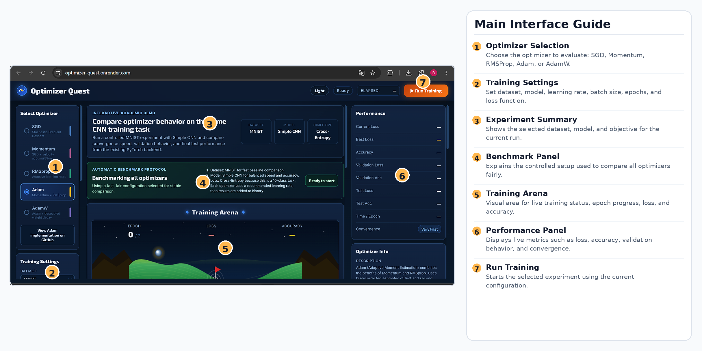
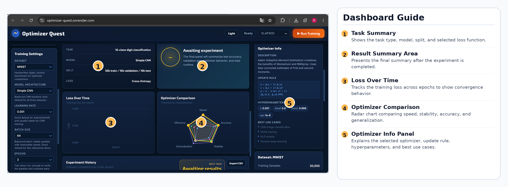
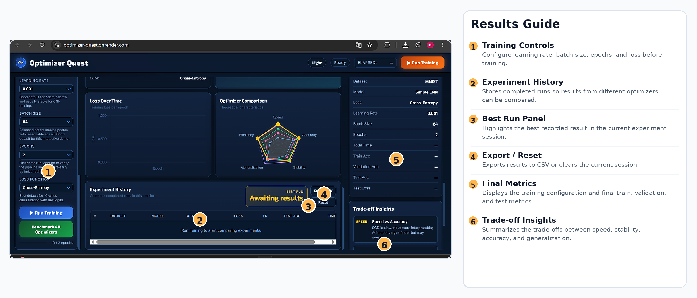

# Optimizer Quest

A concise, interactive web application for exploring and visualizing optimization algorithms used to train neural networks. Optimizer Quest turns a standard image‑classification training loop into a controlled visual experiment so students, researchers, and practitioners can compare optimizer behavior, convergence dynamics, and training stability in real time.

Live demo: https://huggingface.co/spaces/Reem181/optimizer-quest

---

## Features
- Interactive browser interface for configuring and launching training runs.
- Live visualizations and charts for loss, accuracy, and parameter trajectories.
- Configurable model, dataset, optimizer, learning rate, batch size, epochs, and loss function.
- Side‑by‑side comparison mode for benchmarking multiple optimizers.
- Run history with CSV export for reproducible analysis.
- Lightweight frontend simulation mode and full PyTorch training mode.
- Light and dark theme support.

## Supported Optimizers
- Stochastic Gradient Descent (SGD)  
- SGD with Momentum  
- Nesterov Accelerated Gradient (NAG)  
- AdaGrad  
- RMSProp  
- Adadelta  
- Adam  
- AdamW

## Screenshots






## Short Project Description
Optimizer Quest provides an experimental playground to build intuition about optimizer choice in deep learning. Rather than only consulting mathematical derivations, users can run identical experiments under different optimizers and hyperparameters and observe real training traces, convergence rates, and generalization behavior.

## Educational Purpose
Designed primarily for pedagogy and exploratory research, Optimizer Quest helps users:
- Visually compare convergence speed and stability across optimizers.
- Understand the qualitative effect of learning rates, momentum, and adaptive updates.
- Investigate interactions between model capacity and optimizer behavior.
- Support classroom demonstrations, lab assignments, and independent study.

## Tech Stack
- Backend: Python, Flask
- Machine learning: PyTorch, torchvision
- Frontend: HTML, CSS, vanilla JavaScript
- Charts: Chart.js (frontend)
- Deployment: Hugging Face Spaces / Docker (optional)
- Project scripts: `train.py`, `app.py`

## Project Structure
```text
optimizer-quest/
├── app.py
├── train.py
├── requirements.txt
├── Dockerfile
├── Procfile
├── render.yaml
├── railway.toml
├── nixpacks.toml
├── runtime.txt
├── README.md
├── data/
│   └── MNIST/
│       └── raw/
│           ├── t10k-images-idx3-ubyte
│           ├── t10k-labels-idx1-ubyte
│           ├── train-images-idx3-ubyte
│           └── train-labels-idx1-ubyte
├── images/
│   ├── main-interface.png
│   ├── dashboard.png
│   └── results-view.png
├── static/
│   ├── css/
│   │   └── style.css
│   └── js/
│       ├── app.js
│       ├── arena.js
│       ├── charts.js
│       ├── datasets.js
│       ├── nn.js
│       └── optimizers.js
└── templates/
    └── index.html
```

## How to Run Locally

1. Clone the repository and change into the project directory.

2. Create and activate a Python virtual environment:
```bash
python -m venv .venv
# Windows (PowerShell)
.venv\Scripts\Activate.ps1
# macOS / Linux
source .venv/bin/activate
```

3. Install dependencies:
```bash
pip install -r requirements.txt
```

4. Start the Flask application:
```bash
python app.py
```
Open the address printed by Flask (commonly http://127.0.0.1:5000) in your browser.

5. (Optional) Run training experiments directly:
```bash
python train.py
```
See `train.py` for configurable arguments (dataset, model, epochs, batch size, etc.).

Notes:
- The first dataset download (e.g., MNIST) may take additional time.
- Training performance depends on whether PyTorch has access to CUDA; CPU-only runs will be slower.
- The Flask backend uses an in‑memory training state; restarting the server clears run history.

## API Endpoints (overview)
- `GET /` — Renders the main UI.  
- `GET /api/health` — Backend health check.  
- `POST /api/train` — Start a background training job (JSON configuration).  
- `GET /api/train/status` — Poll current training state and metrics.

## Future Improvements
- Add additional optimizers (e.g., Nadam, LAMB) and advanced learning‑rate schedulers.
- Provide notebook‑style guided lessons and interactive tutorials.
- Enable selection of multiple model families (MLP, ResNet‑style CNNs) for richer experiments.
- Add persistent experiment logging (e.g., MLFlow, Weights & Biases) for reproducibility.
- Introduce unit and integration tests for frontend visualizations and backend endpoints.
- Improve accessibility and mobile responsiveness.

## Citation / Academic Use
Optimizer Quest is intended as an educational tool and demonstration platform. If you use the project in coursework or research demonstrations, please credit the author and include a brief description of the experimental settings used for reproducibility.

## Author
Reem Waleed Ahmed
